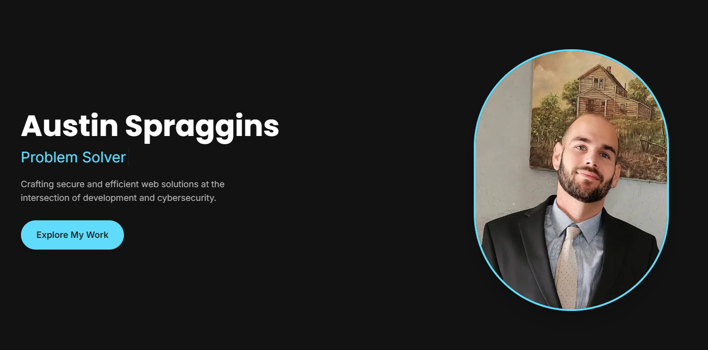

# Austin Spraggins Portfolio

Personal portfolio website showcasing my work as **Co-Founder, CTO & Senior Software Engineer** at [LineCrush Inc](https://www.linecrush.com).



## Live Site

**[spragginsdesigns.xyz](https://www.spragginsdesigns.xyz/)**

## About Me

I build production systems at scale. At LineCrush, I've architected and built:
- **353+ React components** in a Next.js 15 frontend
- **45+ Python microservices** handling real-time data
- **100+ PostgreSQL tables** with complex relationships
- **4+ LLM integrations** (OpenAI, Anthropic, Perplexity, Google Vision)

Currently open to contracts and consulting opportunities.

## Tech Stack

### Portfolio Built With
- **Framework:** Next.js 14 (App Router + Pages Router hybrid)
- **UI:** React 18, TypeScript, Tailwind CSS
- **Components:** shadcn/ui, Aceternity UI
- **Animations:** Framer Motion
- **Icons:** Lucide React
- **Deployment:** Vercel

### My Professional Stack (at LineCrush)
- **Frontend:** Next.js 15, React, TypeScript, Tailwind CSS
- **Backend:** Python, Node.js
- **Database:** PostgreSQL (Neon), Redis
- **AI/ML:** OpenAI, Anthropic, Perplexity, Google Vision
- **Infrastructure:** AWS (S3, SES, CloudFront), Ubuntu VPS, Docker

## Features

### Hero Section
- Full-screen animated background with flowing SVG lines (BackgroundLines)
- Word-by-word text animation effect (TextGenerateEffect)
- Responsive profile image with glow effect
- Role badges and floating stat cards
- "Open to Contracts & Consulting" status indicator

### My Journey (Timeline)
- Scroll-animated timeline showing career progression
- From truck driver to Co-Founder & CTO
- Milestones: Early Days → First Career → Tech Transition → LineCrush → Today

### Expertise & Impact
- Stats row: 353+ Components, 45+ Services, 45+ APIs, 100+ Tables, 4+ LLMs, 2+ Years
- Six expertise cards in bento grid layout:
  - AI/ML Engineering
  - Full-Stack Architecture
  - System Design
  - DevOps & Infrastructure
  - Technical Leadership
  - Data Engineering

### Projects Showcase
- **LineCrush** (Flagship) - Full-stack sports analytics platform
- **Featured Projects:**
  - SaveALife CPR - Business automation system
  - Constrong - Client project for concrete contractor
  - Bible AI Explorer - AI-powered Bible study tool
  - AI Tutor WebApp - Interactive learning platform
- **Additional Projects:** 8 more GitHub repos in compact grid
- Link to view all 50+ repositories

### Contact
- Email contact form with Gmail SMTP integration

### SEO
- Optimized meta tags and Open Graph
- Auto-generated sitemap.xml
- Auto-generated robots.txt
- Twitter card support

## Getting Started

```bash
# Install dependencies
pnpm install

# Run development server
pnpm dev

# Build for production
pnpm build

# Start production server
pnpm start
```

## Environment Variables

Create `.env.local` with:
```
GMAIL_APP_PASSWORD=your_gmail_app_password
YOUTUBE_API_KEY=your_youtube_api_key
```

## Connect With Me

- **GitHub:** [github.com/spragginsdesigns](https://github.com/spragginsdesigns)
- **LinkedIn:** [linkedin.com/in/spragginsdesigns](https://www.linkedin.com/in/spragginsdesigns/)
- **Twitter:** [@spragginsdesign](https://twitter.com/spragginsdesign)
- **Website:** [spragginsdesigns.xyz](https://www.spragginsdesigns.xyz/)

## License

MIT License - feel free to use this as inspiration for your own portfolio!
